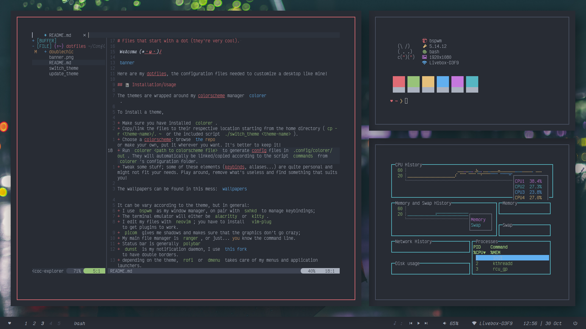

# Files that start with a dot (they're very cool). 

***Welcome (*・ω・)ﾉ***

Here are my dotfiles, the configuration files needed to customize a desktop like mine!

## 📓 Installation/Usage

The themes are wrapped around my colorscheme manager [colorer](https://github.com/kiddae/colorer).

To install a theme,

+ Make sure you have installed `colorer`.
+ Copy/link the files to their respective location starting from the home directory (`cp -r <theme-name>/. ~` or the included script `./switch_theme <theme-name>`).
+ Choose a colorscheme: browse [the repo](https://github.com/kiddae/colorer-colorschemes) or make your own, put it wherever you want. It's better to keep it!
+ Run `colorer <path to colorscheme file>` to generate config files in `.config/colorer/out`. They will automatically be linked/copied according to the script `commands` from `colorer`'s configuration folder.
+ Tweak some stuff; some of these elements (keybinds, aliases...) are quite personal and might not fit your needs. Play around, remove what's useless and find something that suits you!

The wallpapers can be found in this mess: [wallpapers](https://github.com/kiddae/wallpapers)

It can be vary according to the theme, but in general:
+ I use `bspwm` as my window manager, on pair with `sxhkd` to manage keybindings;
+ The terminal emulator will either be `alacritty` or `kitty`.
+ I edit my files with `neovim`; you have to install [`vim-plug`](https://github.com/junegunn/vim-plug) to get plugins to work.
+ `picom` gives me shadows and makes sure that the graphics don't go crazy;
+ My main file manager is `ranger`, or just... you know the command line.
+ Status bar is generally `polybar`
+ `dunst` is my notification daemon, I use [this fork](https://github.com/Barbarossa93/dunst) to have double borders.
+ depending on the theme, `rofi` or `dmenu` takes care of my menus and application launchers.

## 💻 Included scripts

To make the usage and switching of themes easier, I have included (mostly for me):

+ `switch_theme` which takes the name of the theme as argument
+ `update_theme`, which copies files from my home directory to the repository and shows diffs per directory. The flag `-n` does a dry-run.

## ✨Screenshots

### `doublechic`

