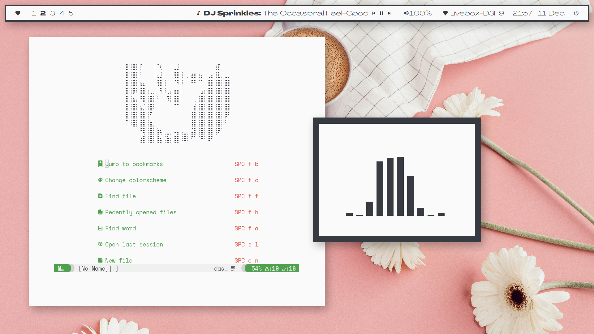

# Screenshots

# Some info

+ Colorscheme: [`onelight`](https://github.com/kiddae/colorer-colorschemes/blob/main/onedark)
+ Wallpaper: [link](https://raw.githubusercontent.com/kiddae/wallpapers/main/misc/umbrella.jpg)
+ Font: `Space Mono` and `Agrandir` ([included](.local/share/fonts/Agrandir))
