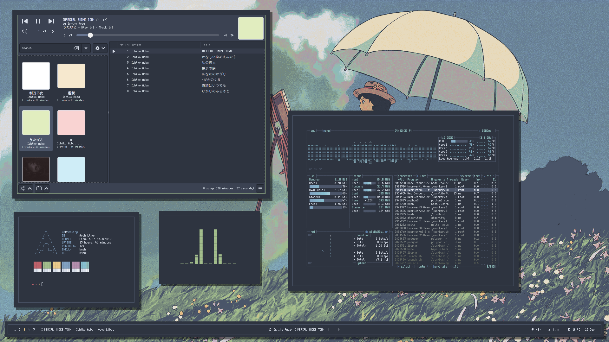
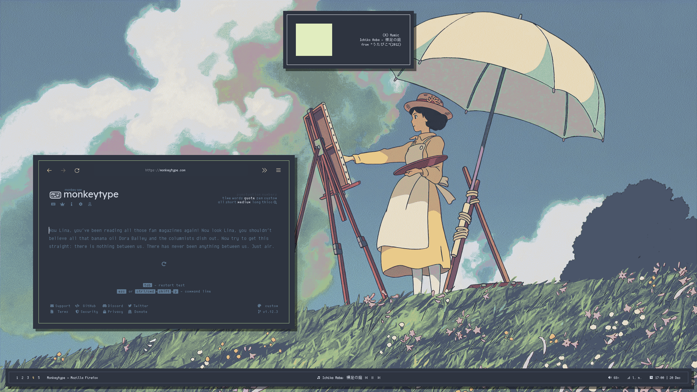

# Screenshots

# Some info

+ Colorscheme: [`nord`](https://github.com/kiddae/colorer-colorschemes/blob/main/nord)
+ Wallpaper: [link](https://raw.githubusercontent.com/kiddae/wallpapers/main/anime/colorized/wallhaven-vg6dqp.jpg)
+ Fonts: `scientifica`, `Cozette`.
+ Terminal: `alacritty`
