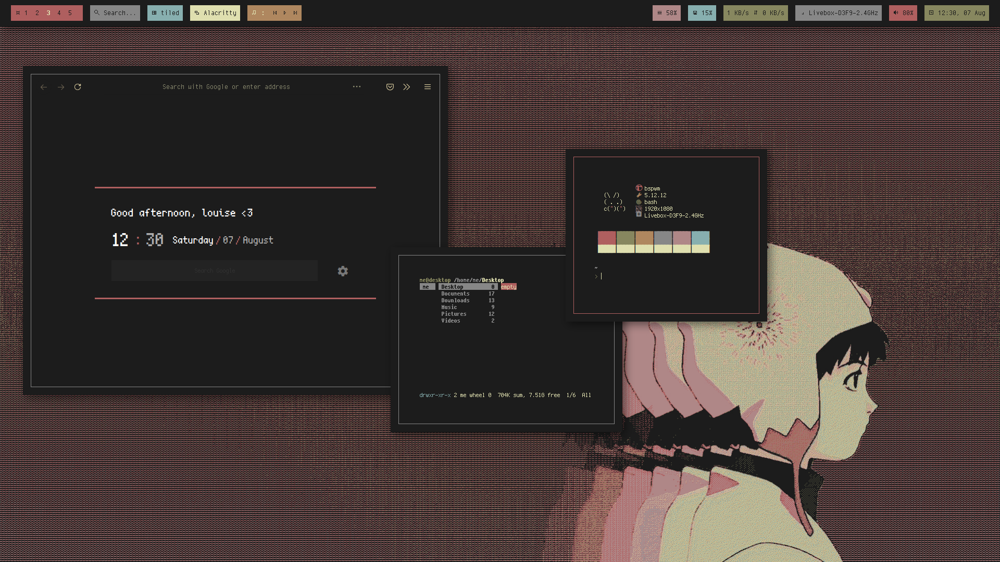

# Screenshots

# Some info

+ Colorscheme: [`alduin`](https://github.com/kiddae/colorer-colorschemes/blob/main/alduin)
+ Wallpaper: [lain.jpg](https://raw.githubusercontent.com/kiddae/wallpapers/main/anime/lain.jpg)
+ Fonts: `Cozette` (terminal), `cherry` (bar)
+ This theme uses Alacritty instead of Kitty.
