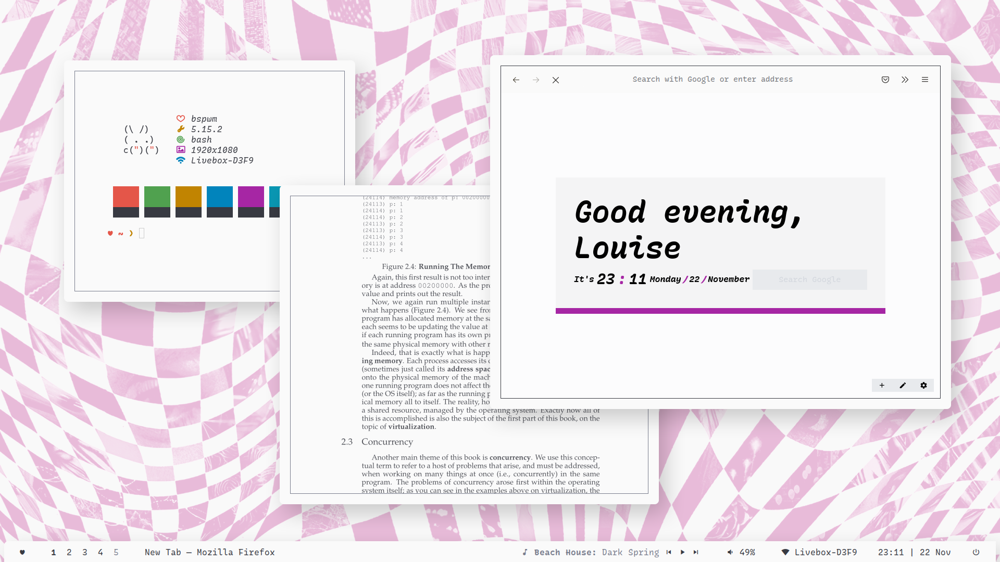

# Screenshots

# Some info

+ Colorscheme: [`onelight`](https://github.com/kiddae/colorer-colorschemes/blob/main/onelight)
+ Wallpaper: [link](https://raw.githubusercontent.com/kiddae/wallpapers/main/misc/umbrella.jpg)
+ Font: `Recursive Mono Casual` and `Recursive Sans Casual` 
