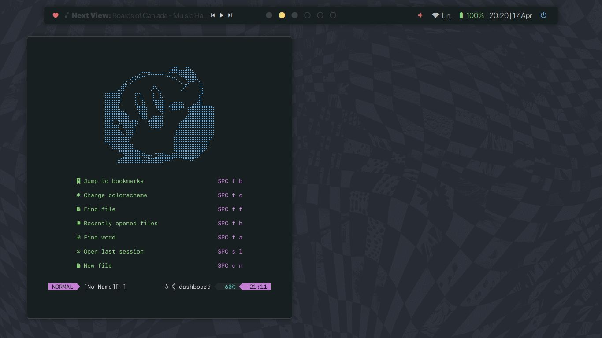

# `sweet`
> Soft and sweet, just like candy.

# Screenshots

# Some info

+ Colorscheme: [`everblush`](https://github.com/kiddae/colorer-colorschemes/blob/main/everblush)
+ Wallpaper: [link](https://raw.githubusercontent.com/kiddae/wallpapers/main/music/colorized/4t2qli7sxom61_c_inv_everblush.png)
+ Font: `SF Pro Text`/`SF Pro Display` and `SF Mono`
+ Shown in the screenshots: `bspwm`, `polybar`, `kitty`, `neovim`

