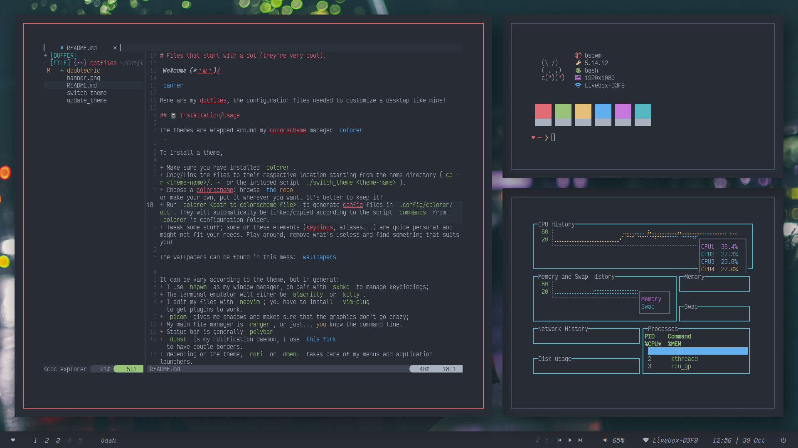
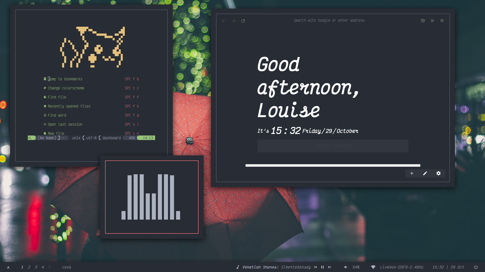

# `doublechic`
> A clean desktop, balanced between eye candy and functionality.

# Screenshots

# Some info

+ Colorscheme: [`onedark`](https://github.com/kiddae/colorer-colorschemes/blob/main/onedark)
+ Wallpaper: [umbrella.jpg](https://raw.githubusercontent.com/kiddae/wallpapers/main/misc/umbrella.jpg)
+ Font: the theme uses `monospace` for every terminal/monospace font so it's easier to change it (here, it's `VictorMono`, you can change it in `./config/fontconfig/fonts.conf` in the aliases section)
+ Shown in the screenshots: `bspwm`, `polybar`, `kitty`, `neovim`, `bunnyfetch`, `cl`, `gtop`, `firefox` with NightTab, `cava`, `2bspwm` for the double borders, `picom`.

